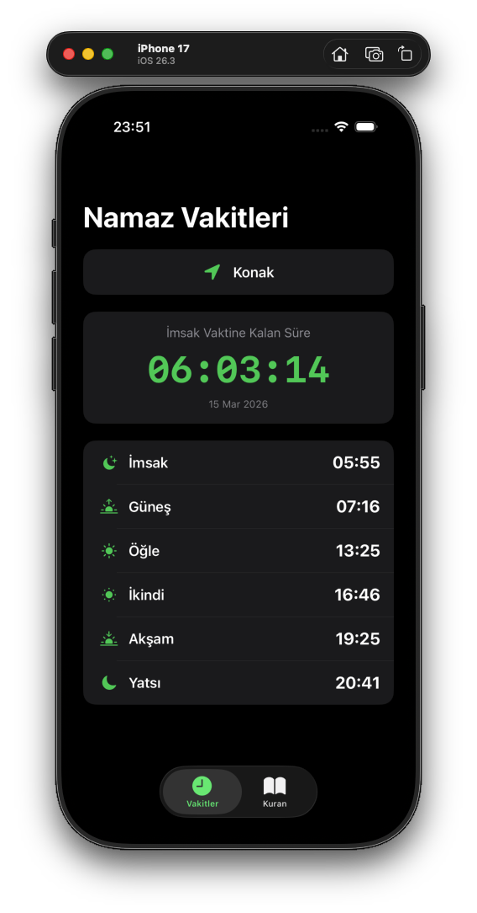
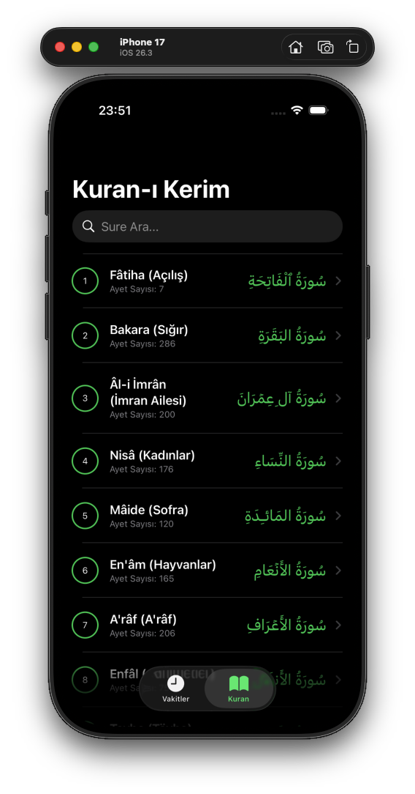
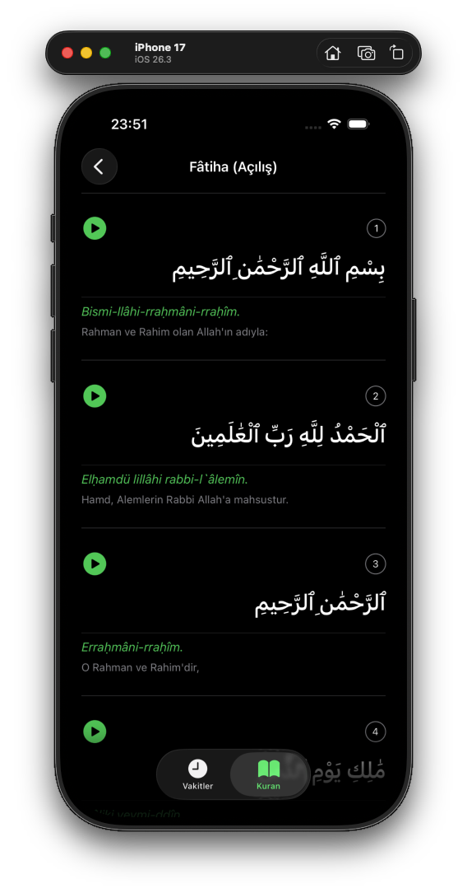

# 🌙 Namaz Vakitleri & Kuran-ı Kerim (iOS App)

Bu proje, kullanıcılara bulundukları konuma göre en doğru namaz vakitlerini sunan ve Kuran-ı Kerim'i hem Arapça metni, hem akademik Türkçe okunuşu hem de Diyanet meali ile okuyup dinleme imkanı sağlayan kapsamlı bir iOS uygulamasıdır. 

Uygulama, modern iOS geliştirme standartlarına uygun olarak **SwiftUI** ve **MVVM** mimarisi kullanılarak sıfırdan geliştirilmiştir.

## ✨ Öne Çıkan Özellikler

* **📍 GPS Tabanlı Namaz Vakitleri:** CoreLocation kullanılarak kullanıcının anlık konumu tespit edilir ve Diyanet İşleri Başkanlığı hesaplama metoduna uygun vakitler sunulur.
* **⏳ Canlı Geri Sayım:** Bir sonraki namaz vaktine kalan süre ana ekranda saniyelik olarak gösterilir.
* **🔔 Yerel Bildirimler:** Vakit girdiğinde Local Notifications (Yerel Bildirimler) altyapısı ile kullanıcıya otomatik ezan bildirimi gönderilir.
* **📖 Kapsamlı Kuran Rehberi:** 114 surenin tamamı listelenebilir ve arama çubuğu (Search Bar) ile anında filtrelenebilir.
* **🎧 Sesli Dinleme (Streaming):** AVFoundation kullanılarak hafızların sesinden ayet ayet cihaz hafızasını doldurmadan internet üzerinden anlık dinleme (stream) özelliği.
* **🇹🇷 Üçlü Okuma Deneyimi:** Her ayet için Orijinal Arapça metin, akademik Türkçe transliterasyon (okunuş) ve Diyanet Türkçe meali bir arada sunulur.

## 🛠 Kullanılan Teknolojiler ve Mimariler

* **Dil:** Swift 6
* **Arayüz:** SwiftUI
* **Mimari:** MVVM (Model-View-ViewModel)
* **Ağ Katmanı (Network):** Modern `async/await` yapısı ile URLSession
* **Apple Frameworks:** * `CoreLocation` (Konum servisleri)
  * `UserNotifications` (Bildirimler)
  * `AVFoundation` (Ses oynatma)
  * `Combine` (Reaktif programlama)

## 📡 Kullanılan API'lar

Uygulama gücünü tamamen ücretsiz ve güvenilir olan iki farklı REST API'dan almaktadır:
1. [Aladhan API](https://aladhan.com/prayer-times-api): Namaz vakitleri ve tarih hesaplamaları için.
2. [Al Quran Cloud API](https://alquran.cloud/api): Kuran ayetleri, mealler, okunuşlar ve ses dosyaları için. (`ar.alafasy`, `tr.transliteration`, `tr.diyanet` edisyonları eşzamanlı çekilmiştir).

## 📱 Ekran Görüntüleri
| Ana Menü (Namaz Vakitleri) | Sure Listesi ve Arama | Ayetler ve Dinleme (Detay) |
|:---:|:---:|:---:|
|  |  |  |

## 🚀 Kurulum

Projeyi kendi cihazınızda çalıştırmak için:
1. Bu repoyu bilgisayarınıza klonlayın: `git clone https://github.com/KULLANICI_ADINIZ/NamazVakitleri-Kuran.git`
2. `.xcodeproj` dosyasını Xcode 14 veya üzeri bir sürümle açın.
3. Herhangi bir harici paket (CocoaPods/SPM) kurulumuna gerek yoktur, doğrudan `Cmd + R` ile çalıştırabilirsiniz.
